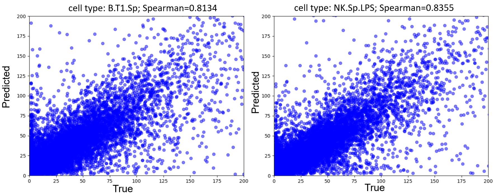

Train_model.sh contains two execution commands, which help us reproduce two models: one is the modified Enformer, and the other is the CNN-based model.

Enformer_Inference.ipynb shows the details of Enformer model, inclduing the parameters, framework. Here, we can adjust the hyper-parameter of 'channels' in model_params to decrase the parameter in Enformer.

CNN_model_Inference.ipynb shows the details of CNN-based model, inclduing the parameters, framework

The results of CNN-based model are shown as follow:

